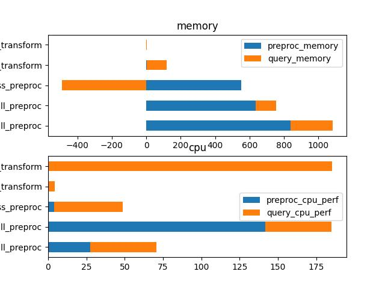

# Datasets
Playing with huggingface's `datasets` library and its basic functionalities.

## Setup
`conda env create -f tfm0.yml`  
`conda activate tfm0`

## How to explore
Most of the book itself focuses on loading pre-existing datasets using the `datasets.load_dataset` function. In contrast, the 2 below notebooks adopt a different focus:
* [nlpt_00_datasets.ipynb](notebooks/nlpt_00_datasets.ipynb) plays with creating datasets from scratch and various datasets manipulations.
* [nlpt_00_ds_transforms.ipynb](nlpt_00_ds_transforms.ipynb) explores how `datasets` plays out when manipulating image data, as well as the performance (speed and memory footprint) of various techniques.

## Main Findings
For image data:
* relying on remote urls (IO bound) is the most detrimental and should be avoided when possible
* `.with_transform` seems to provide strong benefit over `.map` on both pre-proc time and query time.

## References:
* https://huggingface.co/docs/datasets/index

