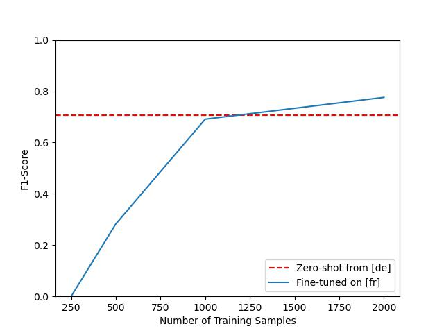
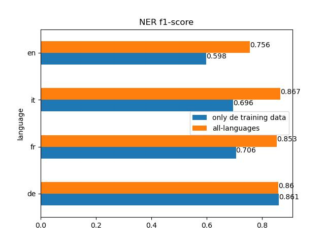

# Chapter 4: Multi-Lingual Transformers and Named Entity Recognition

## How to Install
`conda env create -f tfm4.yml`  
`conda activate tfm4`

## How to use
after setting up your environment, you can execute the notebook [here](notebooks/nlpt_04_MultiLingual_NER.ipynb)

## Dataset
* [`xtreme/pan-x.{de,it,fr,en}`](https://huggingface.co/datasets/xtreme/viewer/PAN-X.de/train)
* down-sampled to simulate various language resource avaibility. below is the training size:
    * de 12580 rows
    * fr 4580 rows
    * it 1680 rows
    * en 1180 rows

## Main Topics Explored in that Chapter
* Named Entity Recognition:
    * goal and ML formulation
    * data pre-processing with tag alignment
    * error analysis techniques
    * evaluation using the `seqeval` library
* Multi-Language Models
    * how much language specific data is necessary to outperform zero-shot transfer learning from higher resource model (e.g. DE to IT in switzerland)  
    
    * Benefits of multi-lingual training > cross language transfer learning (things learnt from one language can be leveraged in other languages)
    

## Refactored
* Error Analysis:
     * created `TokenLossDataFrameBuilder` class to streamline the generation of a dataframe showing NER classification loss for each token, given a dataset / trainer / collator combo.
     * created `NERLossAnalyzer` class to evaluate token values with the highest average loss across the validation dataset
* Pre-processing: 
    * `preproc.py` contains functions to tokenize input sentences and align labels (labels are provided at the word level, not token level in that dataset)
* Metrics: 
    * created `SeqevalConverter` class with a `compute_metrics` method to evaluate sequential results from an f1 perspective.
## References:
* https://huggingface.co/docs/datasets/index