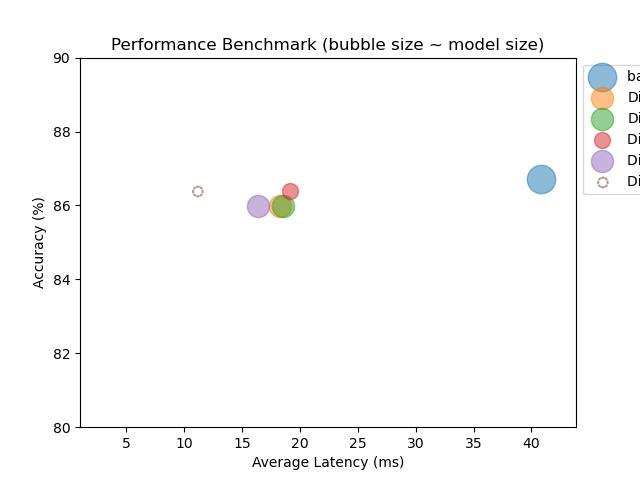

# Chapter 8: Intent Classification - Model Compression

## How to Setup Environment
`make setup`
* sets up a conda environment with necessary dependencies
* activate that environment
* pip installs the local package (`optim`) in editable mode

## How to use
After setting up your environment, you can execute the notebook [here](notebooks/chp)

## Dataset
* [`CLINC150`](https://huggingface.co/datasets/clinc_oos/viewer/plus/train)

## Main Topics Explored in that Chapter
* Performance Benchmarking
    * inference time / model size / accuracy
* hyperparameter tuning with Optuna
* Knowledge Distillation
* Quantization
* ONNX Runtime optimization
The combination of Knowledge Distillation + Quantization + ONNX Runtime allows to decrease by 4x the inference time, while decrease by 6x the model size, without compromising

## Refactored
* Performance Benchmark:
    * handled through a `PerformanceBenchmark` class
    * `PerfMetrics` class to record performance of various model types
* plotting functions are refactored and moved to source code
* ONNX Pipeline: moved to source code
* custom `DistillationTrainer` is moved to source code
* ONNX conversion + quantization turned into a pipeline in [`quantize.py`](src/optim/quantize.py)

## References:
* https://huggingface.co/docs/datasets/index
