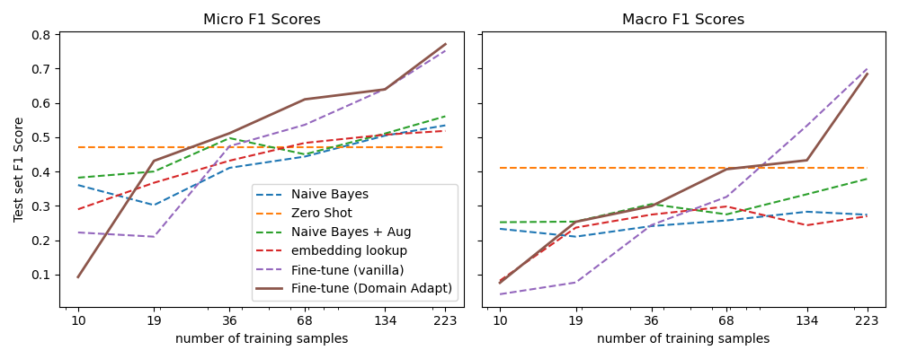

# Chapter 9: Zero to Few Labels
Building a GitHub Issues Tagger

## How to Setup Environment
`make setup`  
`conda activate tfm9`  

the above commands:  
* sets up a conda environment with necessary dependencies
* activates that environment
* pip installs the local package (`fewlabels`) in editable mode

## How to use
After setting up your environment, you can execute the notebook [here](notebooks/chp)

## Dataset
* [github issues tags for nlp with transformers]("https://git.io/nlp-with-transformers")
* 440 labeled issues + 9,303 unlabeled issues

## Main Topics Explored in that Chapter
* Multi-label classification
* Baseline: Naive Bayes cast as a one-vs-rest problem (using `scikit-multilearn`)
* zero-shot classfication: recasting problem as a text entailment problem. 
    * top k vs threshold approach
* Text data augmentation (`nlpaug` library) 
    * token perturbation / back-translation
* Using embeddings as a lookup table (FAISS)
    * how many neighbors? what threshold? > seems a ratio of threshold = 1/3 of total neighbors tends to be optimal:
    

* Fine-Tuning a Vanilla Transformer
* Domain Adaptation: Fine-Tuning language model on unlabeled data before training model on labeled data.
    * approach seems beneficial mostly on low training data regimes (<100 examples)

## Refactored
* Training dataset slicing is refactored and extracted into `preproc.py`
* Evaluation Pipeline to get f1 micro/macro
* Cleaner functions to explore best label selection strategy based on zero shot classification scores (threshold vs top-k)
* Augmentation helper functions are refactored and moved to the [`augment.py`](src/fewlabels/augment.py) module. defined several [callback protocols](https://mypy.readthedocs.io/en/stable/protocols.html) (interfaces) to decouple augmentation implementation from evaluation and batch level augmentation code.
* mean_pooling converted from a function to a torch.nn.Module (`TransformerWithMeanPooling`) and moved to [`knn.py`](src/fewlabels/knn.py)
* creation of `KNNTagger` class allowing, given all texts are turned into embeddings to:
    * find nearest `k` to the query that are labeled.
    * select a label if at least `threshold` neighbors are tagged with that same label.
* gridsearch of best `k`  and `threshold`, based on f1 scores. visualization also refactored.
* adding visualization of best `(k, m)` pairs for various training set sizes.
* Transformer Training on slices: created a `SlicedTrainingRunner` class to handle the process of training a transformer on multiple slices of data and evaluating its performance on test set.
* moved transformer training configs out of the code in json files (cf. [`config/`](config/) section)

## References:
* https://huggingface.co/docs/
